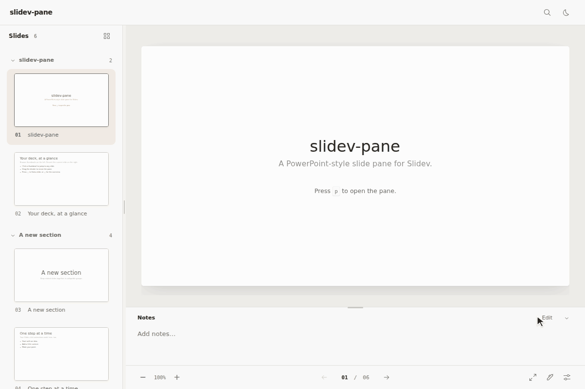

# slidev-pane

An alternative presenter layout for [Slidev](https://sli.dev), with a thumbnail sidebar beside the current slide and speaker notes below it.



*A walkthrough of the included [demo deck](slides.md).*

## What slidev-pane adds

- A dedicated `/pane-view/:no` layout with a thumbnail sidebar and collapsible slide groups.
- Resizable thumbnail and notes panes, remembered pane sizes, and a collapsible notes area.
- Zoom and fit controls for the pane's slide canvas.

## Get started

Install the addon in your Slidev project:

```bash
pnpm add -D slidev-pane
```

Then add it to the deck's `package.json`:

```json
{
  "slidev": {
    "addons": ["slidev-pane"]
  }
}
```

Start your deck as usual, then press **`p`** or choose **Pane View** in Slidev's navigation controls. The pane is also available directly at `/pane-view/1`.

## Controls

Pane mode keeps Slidev's navigation shortcuts and adds controls for toggling the pane and adjusting its canvas.

| Action | Control |
| --- | --- |
| Enter or leave the pane | `p` |
| Open the overview | `o` or the grid icon beside **Slides** |
| Step through slides and click animations | `←` / `→` or the bottom navigation arrows |
| Jump to the previous or next slide | `↑` / `↓` |
| Zoom the canvas | **− / +** or `Ctrl` / `⌘` + scroll over the slide |
| Fit the slide again | Click the zoom percentage |

Search and overview support arrow-key navigation, `Enter` to open a slide, and `Esc` to close.

Drag the divider beside the thumbnails or above the notes to resize a pane. Double-click a divider to restore its default size. Use the chevron beside **Notes** to collapse or expand them. **Edit** opens Slidev's note editor during development.

## Group slides into sections

slidev-pane uses slides with Slidev's `layout: section` as the start of a collapsible thumbnail group named after the slide title. The addon also recognizes a `section` frontmatter field to start and name a group without changing the slide layout:

```yaml
---
section: Custom section name
---
```

## Run the demo locally

```bash
git clone https://github.com/xunz3/slidev-pane.git
cd slidev-pane
pnpm install
pnpm dev:demo
```

## License

[MIT](LICENSE)
