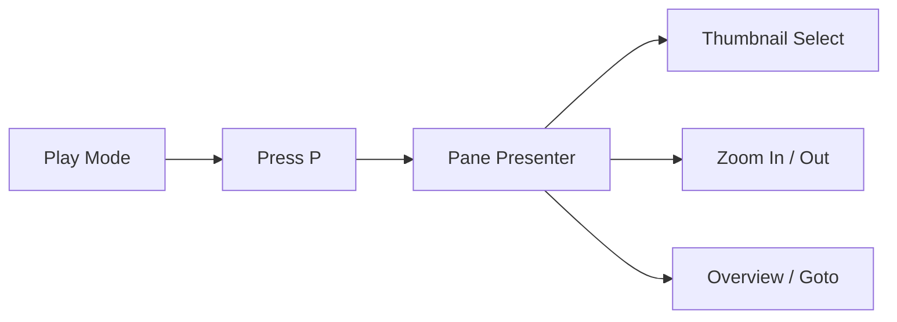

# slidev-pane Demo

这个 deck 用来验证 `slidev-pane` 的侧边栏 presenter 效果。

- 按 `p` 进入或退出 pane presenter
- 看左侧缩略图是否随当前页同步高亮
- 测试翻页、逐步动画、总览、跳转和缩放

---
layout: section
---

# 缩略图导航

确认左侧列表能稳定显示多页内容。

---

# 目录

1. 基础页切换
2. 多步动画
3. 双栏布局
4. 代码块
5. 长列表
6. 结束页

---

# 多步动画

下面几项用于测试当前页在 pane 模式下的 click 递进：

- v1: 初始状态
- v2: 第一层内容
- v3: 第二层内容

<v-clicks>

- 点击一次后出现这条
- 再点击一次后出现这条
- 第三次点击后出现这条

</v-clicks>

<!--
da
da
da
da
da
da
da  
da dasd1 eqeqeq eq  
eqeq
-->

---
layout: two-cols
---

# 双栏页

左栏放说明，右栏放状态块，适合观察主画布缩放后的可读性。

- 当前模式: `pane presenter`
- 目标: 像 PPT 一样快速选页
- 检查点: 缩略图、选中态、键盘翻页

::right::

```ts
const checks = [
  'thumbnail sync',
  'click navigation',
  'goto dialog',
  'zoom controls',
]

export function allGreen() {
  return checks.every(Boolean)
}
```

---

# 代码页

```vue
<script setup lang="ts">
import { useSidebarPresenterNav } from './composables/useSidebarPresenterNav'

const { enterSidebarPresenter, exitSidebarPresenter } = useSidebarPresenterNav()
</script>

<template>
  <button @click="enterSidebarPresenter()">
    Open Pane
  </button>
  <button @click="exitSidebarPresenter()">
    Close Pane
  </button>
</template>
```

---

# 长列表

这一页用于测试缩略图滚动和当前页定位。

1. alpha
2. beta
3. gamma
4. delta
5. epsilon
6. zeta
7. eta
8. theta
9. iota
10. kappa
11. lambda
12. mu

---

# 图示页



---

# 跳转测试

可以在 pane presenter 里试这些动作：

- 按 `g` 打开 Goto
- 输入页码或标题关键字
- 回车跳转，看主区和侧栏是否同时更新

---

# 末尾前一页

继续往后翻，确认：

- 最后一页前仍然能正常高亮
- 左侧滚动不会抖动
- 底部计数器数字正确

---
layout: center
class: text-center
---

# Done

`slidev-pane` 本地测试 deck 已准备好。

按 `p` 打开 pane presenter，重点看缩略图同步、缩放和跳转。
